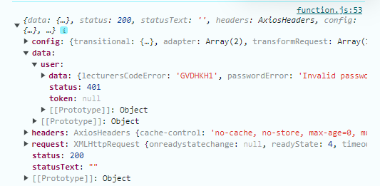
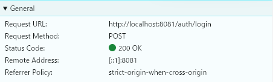
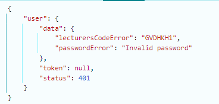
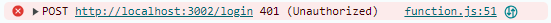
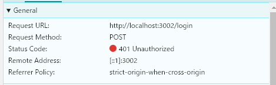
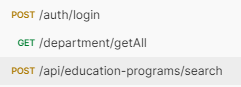

# 20240809

### Các file script cần gửi ở folder data chơ ko gửi ở tin nhắn (như m nói dễ trôi đó) + định dạng [Năm Tháng Ngày]_Nội dung file

## Lỗi CORS

```java
	@CrossOrigin(origins = "http://localhost:3030")
	@PostMapping("/login")
	public ResponseEntity<AuthenticationResponse> authenticate(@RequestBody AuthenticationRequest request) {
		return ResponseEntity.ok(service.authenticate(request));
	}
```
Như code trên, t có thể chạy được login rồi ha, nhưng như code dưới thì không

```java
@RestController
@RequestMapping("/auth")
public class AuthenticationController {
	@Autowired
	private AuthenticationService service;

	//Api để đưa dữ liệu gv vào db
	
	@CrossOrigin(origins = "http://localhost:3030")
	@PostMapping("/register")
	public ResponseEntity<AuthenticationResponse> register(@RequestBody RegisterRequest request) {
		System.out.println(request.getDepartmentId());
		return ResponseEntity.ok(service.register(request));
	}
	
	@PostMapping("/login")
	public ResponseEntity<AuthenticationResponse> authenticate(@RequestBody AuthenticationRequest request) {
		return ResponseEntity.ok(service.authenticate(request));
	}
}
```

Điều ni có nghĩa là cái CORS nớ cần được đặt trước mỗi API

==> Bị 1 vẫn đề: ví dụ t đổi port (vì tương lai sẽ đổi) hoặc deploy thì sẽ phải đổi thủ công or đổi rất nhiều nơi

==> **CẦN MỘT GIẢI PHÁP ĐỂ CHỈ CẦN @ hắn 1 lần or đổi mộc chỗ mô đó thôi**


## VẤN ĐỀ TÊN API
```json 
"user": {
        "data": {
            "firstName": "Lương",
            "lastName": "Trần Thanh",
            "departmentName": "Khoa công nghệ và kĩ thuật",
            "email": "ttluong@gmail.com",
            "lecturerCode": "GVDHKH1",
            "role": [
                "tao_ctdt",
                "duyet_ctdt"
            ]
        },
        "token": "bsjbdnvknkfgvnrnnfkv",
        "status": 200
    },
```
Như t đã nói, cái user nớ là tên thôi, còn thứ t cần tính từ dấu ngoặc vì m sẽ trả về 1 object chơ ko phải 1 feature. Tên nớ để t gọi khi call fake api thôi.

==> Sửa lại + t đã xóa trên sheet cho đỡ sai rồi nha.


## API LOGIN
Có vấn đề như sau:

- Đăng nhập sai nhưng vẫn trả về đúng dù status khác but phải trả về lỗi để t catch đc




- Dù cái m trả ra hắn vẫn đúng ở chỗ duy nhất là cái data thôi + status của json. Nhưng m ko có trả lỗi thì hắn sẽ ko bao giờ vô cái hãm lỗi của t cả. 



- Dưới ni là ví dụ đúng




==> **Lỗi trả về là tiến Việt "Người dùng không tồn tại" và "Mật khẩu không đúng" vì t sẽ cầm cái ni cập nhật lên UI luôn**

## THỐNG NHẤT TÊN API


Tại răng đang route auth, department lại lòi ra 1 cái api ri =)))))
